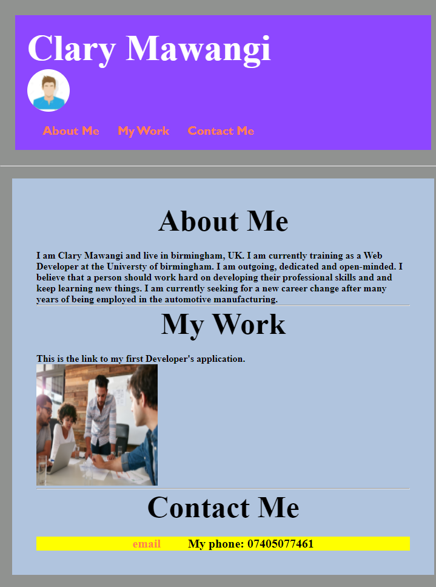

# MY PORTFOLIO 

## Description

In this week homework, I was given the task to create a Web application from scratch.
I had to create a portfolio page to show to potential employers.

A portfolio of work can showcase my skills and talents to potential employers looking to fill a part-time or full-time postion within their companies.

This homework did help me to practice new skills I have recently learned like: Flex box, Media queries and css variables.

## Deployed Link

## Screenshot

## License

This Portfolio is licensed under the 

## Created by:

This Portfolio was created by Clary Nsiku Mawangi

